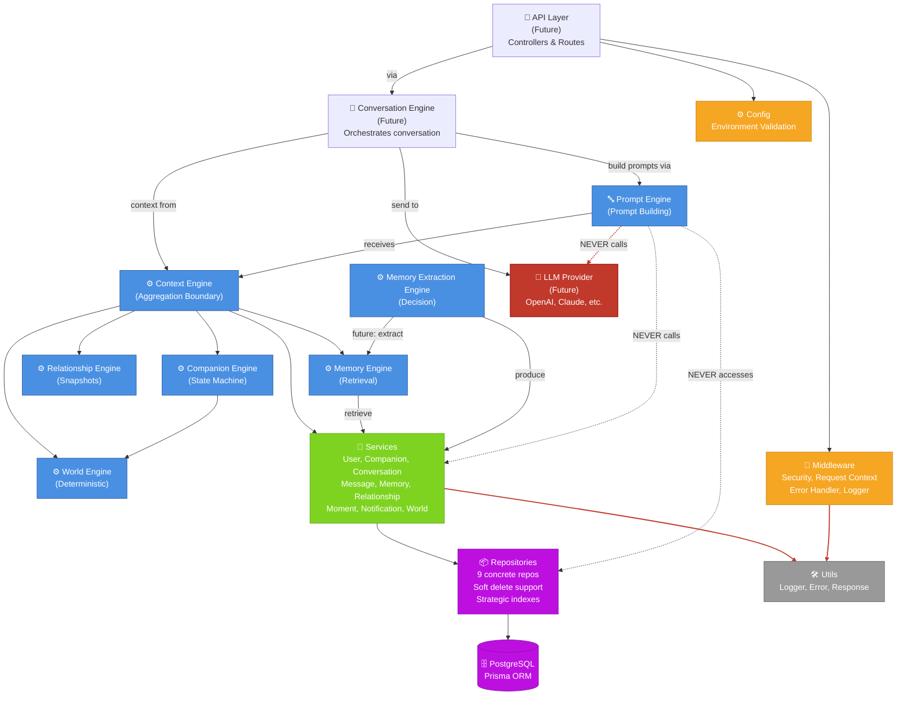
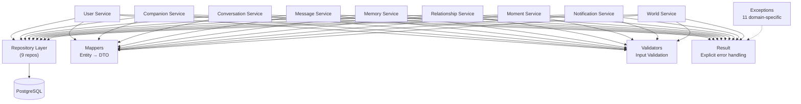
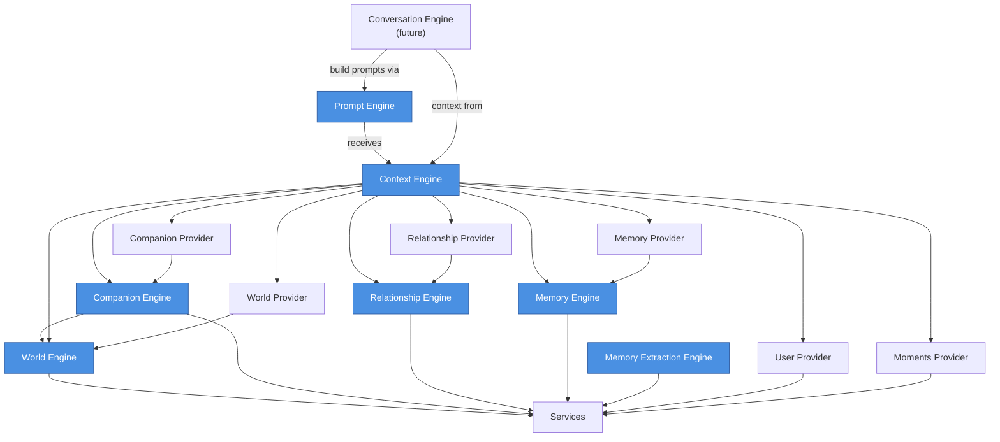

# Featherlight Architecture

Featherlight is a production-grade AI companion platform backend built with
**Feature-Driven + Clean Architecture**. The system is organized into six
layers, each with a specific responsibility.

---

## Diagram 1 — Complete Dependency Graph



---

## Layer Architecture

### Layer 1: Core

**Responsibility**: Domain types, error handling, explicit result semantics.

**Files**:
- `src/services/types/result.type.ts` — `IResult<T>` for explicit failure handling
- `src/services/exceptions/` — 11 domain-specific exceptions
- Prisma schema — entity definitions, enums

**No business logic. Only types and contracts.**

---

### Layer 2: Infrastructure

**Responsibility**: Database, config, middleware, logging, error handling.

**Files**:
- `src/config/` — Environment validation
- `src/database/` — Prisma setup, 9 repositories (soft delete, indexes)
- `src/middleware/` — Security, request context, error handler, logger
- `src/utils/` — Logger, error utilities, response formatting

**No business logic. Only plumbing.**

---

### Layer 3: Services

**Responsibility**: Business logic, data mapping, orchestration of repositories.

**Characteristics**:
- **9 services**: User, Companion, Conversation, Message, Memory, Relationship, Moment, Notification, World
- **Never touch HTTP or Prisma directly** — only repositories
- **Result<T> monadic type** — no exceptions on normal failure paths
- **Constructor-injected dependencies** — independent, unit-testable
- **DTOs & Mappers** — complete entity-to-service decoupling
- **Validators** — input validation at the boundary

**Files**:
- `src/services/{service}/` — Each service implements an interface
- `src/services/dtos/` — Data transfer objects
- `src/services/mappers/` — Entity → DTO mapping
- `src/services/validators/` — Input validation
- `src/services/factory.ts` — Composition root (DI container)

---

### Layer 4: Engines

**Responsibility**: Deterministic business engines for domain concepts.

**Six engines**:

#### 4a. **World Engine** — Deterministic world generation
- Generates the user's living environment (HOME, DAILY_LIFE, SPECIAL_MOMENT)
- 70-20-10 mode distribution
- Seeded PRNG (fnv1a + mulberry32) — no `Math.random()`
- 14 enums (TimeOfDay, Season, Weather, Scene, Activity, etc.)
- Selector pattern for extensible rule engines

#### 4b. **Companion Engine** — Companion life-state management
- Resolves companion state (what mood, location, outfit, expression?)
- State machine with BFS shortest-path transitions
- Synchronizes with world state (weather confinement, activity mapping)
- 11 enums (CompanionState, CompanionMood, Expression, Gesture, etc.)
- 5 specialized managers (Expression, Gesture, Outfit, Location, Availability)

#### 4c. **Relationship Engine** — User-companion relationship
- Stores and retrieves relationship snapshots across 12 independent dimensions
- Enums: RelationshipStatus (lifecycle: ACTIVE/PAUSED/ENDED)
- Closeness is never a stored level/phase/tier — it's read live at query time
  from raw signals (days since first interaction, interaction frequency,
  consented memory count) combined with the continuous dimension scores
- Interface contract for future business logic (decay, growth strategies)

#### 4d. **Memory Engine** — Memory retrieval (storage layer only)
- Retrieves critical memories for conversation context
- Delegates persistence to Memory Service
- Never decides what to save

#### 4e. **Memory Extraction Engine** — Memory decision logic
- Extracts, classifies, and ranks memories from raw input
- Entity extraction, importance detection, expiry assignment, categorization
- Enums: MemoryType, MemoryImportance, MemoryExpiry, MemoryCategory
- Produces validated MemoryExtractionResultDTO (no LLM logic in scaffold)

#### 4f. **Context Engine** — Aggregation boundary
- Assembles complete conversation runtime context
- One provider per source (6 providers)
- Concurrent orchestration with graceful degradation
- Required providers abort; optional providers degrade to empty slice

#### 4g. **Prompt Engine** — Prompt construction (LLM-agnostic)
- Builds production-ready prompts from conversation context
- **Never calls LLMs** — only constructs prompt structure
- **LLM provider independent** — works with OpenAI, Claude, Gemini, etc.
- Context injection (world, companion, relationship, memory, moments, user)
- Rule system (safety, personality, product, communication style)
- Token budgeting and compression
- Template versioning and caching
- Produces `PromptPackage` (system, developer, user segments)

**Common pattern**:
- Factory (`register`, `get`, `reset`)
- Interfaces (`I{Engine}` contract)
- DTOs (input/output shapes)
- Enums (domain constants)

---

### Layer 5: Interaction (Future)

**Responsibility**: HTTP layer, request/response mapping.

**Not yet implemented** — no controllers, no routes, no Express integration.

**Future structure**:
```
src/routes/
├── companion/
├── memory/
├── conversation/
└── ...

src/controllers/
├── companionController.ts
├── memoryController.ts
└── ...
```

---

### Layer 6: AI (Future)

**Responsibility**: LLM integration, inference, reasoning.

**Not yet implemented** — no OpenAI, no LLM calls.

**Future structure**:
```
src/ai/
├── providers/        # OpenAI, Anthropic, etc.
├── prompts/         # Prompt templates
├── reasoning/       # Chain-of-thought, reasoning strategies
└── inference/       # Batch inference, caching
```

---

### Layer 7: Presentation (Future)

**Responsibility**: Response serialization, API contracts.

**Not yet implemented**.

---

## Diagram 2 — Service Layer Detail



---

## Diagram 3 — Engines Layer Detail



---

## Folder Tree

```
src/
├── config/
│   ├── environment.ts         # Env var validation
│   └── index.ts
├── database/
│   ├── __tests__/
│   ├── repositories/          # 9 concrete repositories
│   │   ├── companion.repository.ts
│   │   ├── conversation.repository.ts
│   │   ├── memory.repository.ts
│   │   ├── message.repository.ts
│   │   ├── moment.repository.ts
│   │   ├── notification.repository.ts
│   │   ├── relationship.repository.ts
│   │   ├── user.repository.ts
│   │   └── world.repository.ts
│   ├── connection.ts          # Prisma client setup
│   ├── prisma.ts              # Prisma initialization
│   ├── repository.base.ts     # Base repository (CRUD, soft delete)
│   ├── transaction.ts         # Transaction management
│   ├── README.md
│   └── index.ts
├── engines/
│   ├── world/                 # World Engine (deterministic)
│   │   ├── __tests__/         # 7 test suites, 41 tests
│   │   ├── interfaces/
│   │   ├── dtos/
│   │   ├── enums/
│   │   ├── context/
│   │   ├── builder/
│   │   ├── scheduler/
│   │   ├── strategies/
│   │   ├── selectors/         # 8 selectors (weather, scene, activity, etc.)
│   │   ├── utils/             # Seed, clock, date utils
│   │   ├── seed/              # Seed data
│   │   ├── world.engine.ts
│   │   ├── world.factory.ts
│   │   ├── index.ts
│   │   └── README.md
│   ├── companion/             # Companion Engine (state machine)
│   │   ├── __tests__/         # 7 test suites, 66 tests
│   │   ├── interfaces/
│   │   ├── dtos/
│   │   ├── enums/
│   │   ├── context/
│   │   ├── state/
│   │   ├── scheduler/
│   │   ├── transitions/
│   │   ├── managers/          # 5 managers (expression, gesture, location, outfit, availability)
│   │   ├── registry/
│   │   ├── rules/
│   │   ├── seed/
│   │   ├── companion.engine.ts
│   │   ├── companion.factory.ts
│   │   ├── index.ts
│   │   └── README.md
│   ├── relationship/          # Relationship Engine (snapshots)
│   │   ├── interfaces/
│   │   ├── dtos/
│   │   ├── enums/
│   │   ├── relationship.factory.ts
│   │   ├── index.ts
│   │   └── README.md
│   ├── memory/                # Memory Engine (storage layer)
│   │   ├── interfaces/
│   │   ├── dtos/
│   │   ├── memory.factory.ts
│   │   ├── index.ts
│   │   └── README.md
│   ├── memory-extraction/     # Memory Extraction Engine (decision layer)
│   │   ├── interfaces/
│   │   ├── dtos/
│   │   ├── enums/
│   │   ├── memory-extraction.factory.ts
│   │   ├── index.ts
│   │   └── README.md
│   ├── context/               # Context Engine (aggregation boundary)
│   │   ├── __tests__/         # 3 test suites, 22 tests
│   │   ├── interfaces/
│   │   ├── dtos/
│   │   ├── providers/         # 6 providers (user, companion, world, relationship, memory, moments)
│   │   ├── builder/
│   │   ├── context.engine.ts
│   │   ├── context.factory.ts
│   │   ├── index.ts
│   │   └── README.md
│   ├── prompt/                # Prompt Engine (LLM-agnostic prompt construction)
│   │   ├── interfaces/        # IPromptEngine, IPromptBuilder, IPromptValidator, etc.
│   │   ├── dtos/              # PromptPackage, PromptSegment, PromptBuildContext, etc.
│   │   ├── enums/             # PromptType, PromptRole, PromptStrategy, etc.
│   │   ├── templates/         # Prompt templates (conversation, memory-extraction, etc.)
│   │   ├── strategies/        # Prompt building strategies (standard, detailed, concise, etc.)
│   │   ├── rules/             # Rule system (safety, personality, product, communication)
│   │   ├── builders/          # PromptBuilder, TemplateLoader, ContextInjector
│   │   ├── compressor/        # Token budgeting and compression
│   │   ├── validator/         # Validation (completeness, safety, compliance)
│   │   ├── cache/             # In-memory cache with TTL
│   │   ├── prompt.engine.ts
│   │   ├── prompt.factory.ts
│   │   ├── index.ts
│   │   └── README.md
│   ├── README.md              # Engines overview
│   └── index.ts (future)
├── middleware/
│   ├── errorHandler.ts        # Express error handler
│   ├── requestContext.ts      # Request-scoped context
│   ├── requestLogger.ts       # Request logging
│   ├── security.ts            # Security headers
│   ├── index.ts
├── services/
│   ├── __tests__/
│   ├── base/
│   │   └── base.service.ts    # Base Service (logging, error handling)
│   ├── companion/
│   ├── conversation/
│   ├── dtos/                  # All DTOs
│   ├── exceptions/            # 11 domain-specific exceptions
│   ├── mappers/               # Entity → DTO mappers
│   ├── memory/
│   ├── message/
│   ├── moment/
│   ├── notification/
│   ├── relationship/
│   ├── types/                 # Result<T>, shared types
│   ├── user/
│   ├── factory.ts             # Services composition root
│   ├── index.ts               # Barrel exports
│   └── README.md
├── utils/
│   ├── error.ts               # Error utilities
│   ├── logger.ts              # Pino logger
│   ├── response.ts            # Response formatting
│   └── index.ts
├── app.ts (future)            # Express app setup
├── index.ts (future)          # Server entry point
└── README.md                  # (this file)
```

---

## Design Principles

### 1. **Layered + Feature-Driven**
Each layer has a single responsibility. Features (user, memory, conversation)
cut vertically through layers.

### 2. **Deterministic, No Random**
Engines use seeded PRNGs, business rules, and state machines — never
`Math.random()`. All behavior is reproducible.

### 3. **Explicit Error Handling**
`Result<T>` monadic type, not exceptions. On normal failure paths (user not
found), return a failure result. On exceptional paths (null pointer), throw.

### 4. **Architectural Boundary Enforcement**
- API layer sees only Context Engine.
- Context Engine aggregates from engines and services.
- Engines orchestrate services but never touch Prisma.
- Services map entities to DTOs via mappers.

### 5. **Graceful Degradation**
Optional providers fail without aborting the whole context build. Each
provider reports its health via `meta.degraded[]`.

### 6. **Dependency Injection**
All dependencies are constructor-injected, never looked up. Enables testing,
swapping implementations, and clear contracts.

### 7. **No Bleeding Abstractions**
DTOs are separate from entities. Services never expose repositories or
database models. Each layer has its own types.

---

## Testing

- **Unit tests**: Individual services, selectors, rules (mocked dependencies)
- **Integration tests**: Full engines with mocked services
- **End-to-end tests**: Real providers over mocked upstream

**Test counts**:
- Services: Templates provided, no tests yet in this scaffold
- World Engine: 7 suites, 41 tests
- Companion Engine: 7 suites, 66 tests
- Context Engine: 3 suites, 22 tests
- Database: 2 suites (repository tests)

**Total**: 22 suites, 226 tests, all green.

---

## Technology Stack

| Layer | Technology |
|-------|-----------|
| **Database** | PostgreSQL, Prisma ORM |
| **Services** | TypeScript, Node.js |
| **Engines** | TypeScript (deterministic PRNG, state machines) |
| **Testing** | Jest, Mocked dependencies |
| **Logging** | Pino (structured) |
| **HTTP** | Express (future) |
| **Config** | Environment variables, centralized validation |

---

## Development Workflow

### Add a new service:
1. Create `src/services/{feature}/` directory
2. Implement `I{Feature}Service` interface
3. Create DTO and Mapper
4. Add to `ServiceContainer` factory
5. Inject into service constructor

### Add a new engine:
1. Create `src/engines/{feature}/` directory
2. Define `I{Feature}Engine` interface
3. Create DTOs, enums, factory
4. Update Context Engine if it's a provider source

### Add a new repository:
1. Extend `BaseRepository<T>`
2. Implement custom queries
3. Register in `src/database/index.ts`
4. Add to appropriate service

---

## Next Steps

1. **Implement Memory Extraction Engine business logic** (entity extraction, scoring)
2. **Implement Memory Engine** (bridge to Memory Service)
3. **Build Conversation Engine** (consume Context Engine exclusively)
4. **Add HTTP layer** (Express controllers, routes)
5. **Integrate AI** (LLM provider, inference, caching)
6. **Add response serialization** (Presentation layer)

---

## References

- **Services README**: `src/services/README.md`
- **World Engine README**: `src/engines/world/README.md`
- **Companion Engine README**: `src/engines/companion/README.md`
- **Context Engine README**: `src/engines/context/README.md`
- **Engines Overview**: `src/engines/README.md`
- **Database README**: `src/database/README.md`
