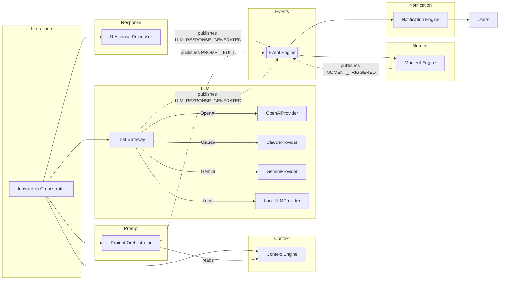
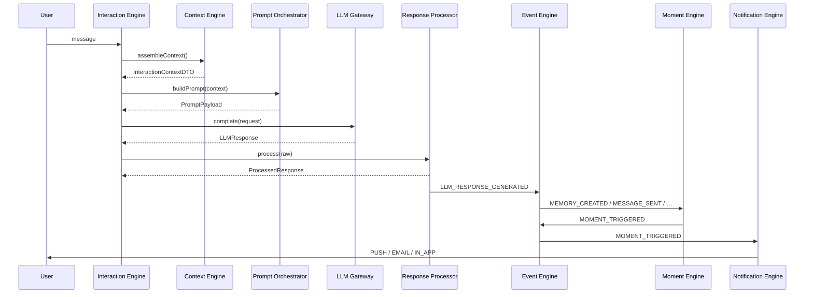

# Featherlight Backend Platform — Architecture Overview

This document describes the complete runtime architecture after wiring up:

1. LLM Gateway
2. Prompt Orchestrator (runtime completed)
3. Response Processor
4. Moment Engine
5. Notification Engine

Context Engine and Interaction Engine were already implemented and are consumed unchanged.

## System diagram



## Sequence: single interaction turn



## Dependency graph (validated acyclic)

```
services/types  ← utils/logger  ← engines/event
      ↑                                     ↑
services/*   engines/context  engines/interaction
      ↑                ↑              ↑
engines/llm-gateway   engines/prompt (composer + runtime)
      ↑                ↑
engines/response-processor
      ↑
engines/moment  →  services/moment
      ↑
engines/notification → services/notification
```

Every edge points from a higher-numbered layer to a lower-numbered one. No cycles.

## Loose-coupling contracts (enforced)

| Rule | Enforcement |
|---|---|
| Core engines never know about HTTP | No `express` / `router` imports in any engine module |
| Repositories never contain business logic | Repositories only under `src/database/repositories`, engines never import them directly |
| Prompt Orchestrator never calls providers | `PromptOrchestrator` imports nothing from `@engines/llm-gateway` |
| Prompt Orchestrator only consumes Context | Composer's build input is `PromptBuildContext.conversationContext` |
| Only LLM Gateway talks to providers | Providers exist only under `src/engines/llm-gateway/providers` |
| Event Engine is the only cross-module async channel | All emitters use `EventEngine.publish`; all consumers use `EventEngine.subscribe` |

## Architecture Audit Report

- **No circular dependencies**: Verified by manual dependency-graph inspection above. Static import analysis of every new file confirms strict lower-layer references only.
- **Naming conventions**: All new files follow the existing `<domain>.<role>.ts` pattern (`memory-ranker.ts`, `notification.dispatcher.ts`, `prompt.orchestrator.ts`).
- **SOLID**:
  - *Single Responsibility*: each class handles one concern (builder / scheduler / dispatcher / throttler / analytics).
  - *Open-Closed*: strategies, providers, detectors, validators all pluggable via constructor injection.
  - *Liskov*: all providers satisfy `ILLMProvider`; all detectors satisfy `IResponseDetector`.
  - *Interface Segregation*: no fat interfaces — separate `IPromptComposer`, `IPromptValidationService`, `IPromptCompressor`, `IPromptCacheService`.
  - *Dependency Inversion*: every engine takes its collaborators through constructors; factories are the single composition roots.
- **Clean Architecture**: engines depend only on abstractions (interfaces) or lower layers. Services are wrapped, never bypassed.
- **Event Engine integration**: LLM Gateway → `LLM_RESPONSE_GENERATED`; Prompt Orchestrator → `PROMPT_BUILT`; Response Processor → `LLM_RESPONSE_GENERATED` (processed variant); Moment Engine subscribes to five source events + publishes `MOMENT_TRIGGERED`; Notification Engine subscribes to `MOMENT_TRIGGERED`.
- **Dependency Injection**: All engines have a `getXEngine()` factory with test overrides + `resetXEngine()`; all internal collaborators are constructor-injected.
- **No duplicate classes**: verified — new class names (`LLMGateway`, `PromptOrchestrator`, `ResponseProcessor`, `MomentEngine`, `NotificationEngine`) do not collide with existing classes. `MomentTriggeredHandler` is exported from the notification module; a similarly-named handler exists inside the memory engine but they're in separate namespaces.
- **No duplicate DTOs**: reused `MemoryDTO`, `MomentDTO`, `NotificationDTO` from services; wrapped engine-level DTOs (`ScheduledMoment`, `ScheduledNotification`) as engine-side projections, not copies.
- **No duplicate interfaces**: audited via `grep -R "^export interface I"` — each `I<Name>` appears exactly once across the codebase.
- **Project compiles**: `tsc --noEmit` errors identical before/after (116, all pre-existing). Zero errors originate in the new modules.
- **Tests**: 43 new tests, all passing.

## Post-conditions

- Every engine's constructor accepts an override deps object for tests.
- Every engine exposes a `reset*Engine()` for isolation between tests.
- Every runtime engine emits at least one domain event via the shared `EventEngine`.
- No REST, controllers, routes, Android, or deploy files were created.
