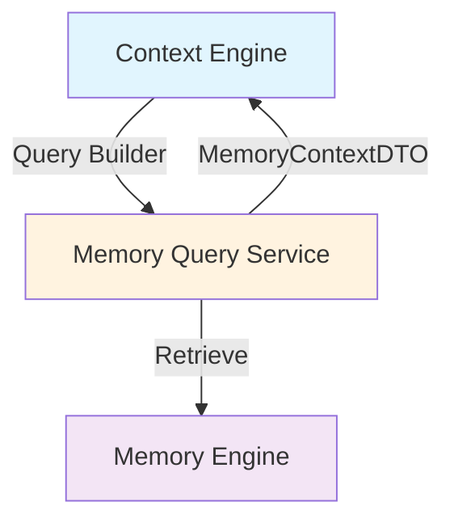
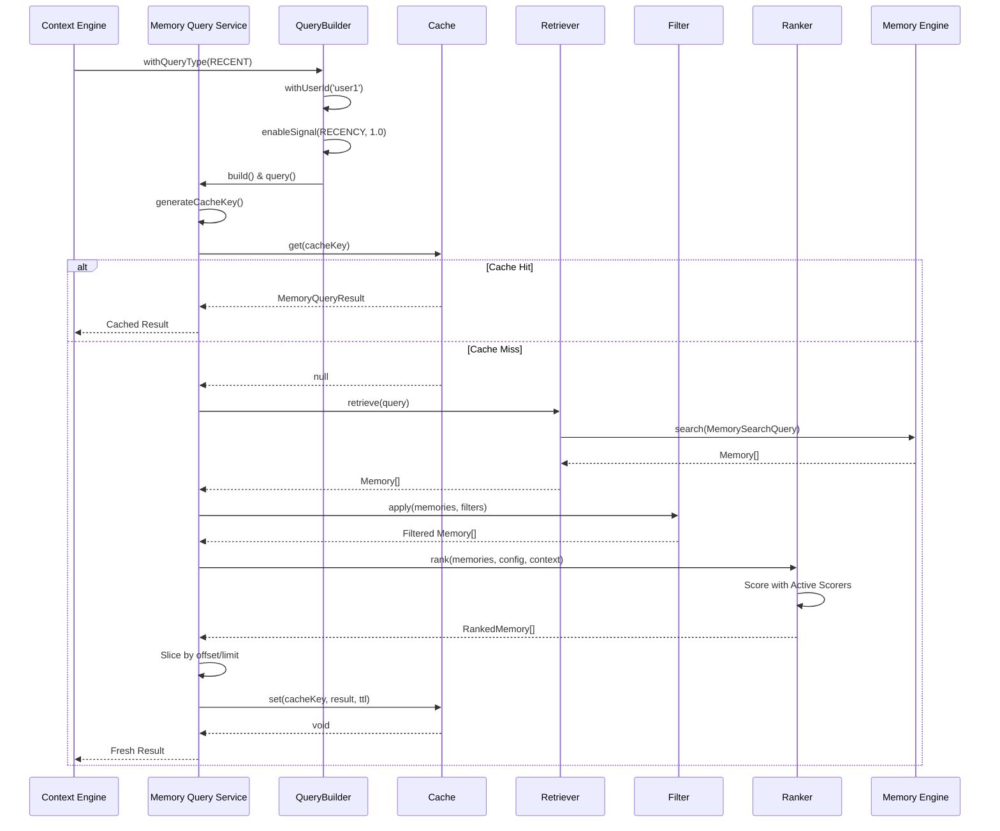

# Memory Query Service Architecture

## Overview

The Memory Query Service is a dedicated abstraction layer that enforces loose coupling between the Context Engine and Memory Engine. It provides a comprehensive querying and ranking system for retrieving the most relevant memories without exposing database models or allowing memory mutations through the query interface.

## High-Level Architecture



## Detailed Component Architecture

```mermaid
graph TB
    subgraph "Entry Points"
        QueryBuilder["QueryBuilder<br/>(Fluent Interface)"]
        ServiceMethods["Service Methods<br/>(queryRecent, queryByEntity...)"]
    end
    
    subgraph "Memory Query Service Core"
        Service["MemoryQueryService"]
        Cache["Query Cache<br/>(TTL-based)"]
    end
    
    subgraph "Processing Pipeline"
        Retriever["MemoryRetriever<br/>(Memory Engine Adapter)"]
        Filter["MemoryFilter<br/>(11 Filter Types)"]
        Ranker["MemoryRanker<br/>(Score Aggregation)"]
    end
    
    subgraph "Scoring Signals"
        Scorers["Scorer Implementations"]
        SR["RecencyScorer"]
        SI["ImportanceScorer"]
        SC["ConfidenceScorer"]
        SE["EntityOverlapScorer"]
        SExp["ExpiryScorer"]
        SRel["RelationshipRelevanceScorer"]
        SConvRel["ConversationRelevanceScorer"]
        SWorld["WorldRelevanceScorer"]
        SFresh["FreshnessScorer"]
        SConvFreq["ConversationFrequencyScorer"]
    end
    
    subgraph "Context Matching"
        ContextMatcher["MemoryContextMatcher<br/>(Activity, Scene, Mood, Entities)"]
    end
    
    subgraph "Factory"
        Factory["MemoryQueryFactory<br/>(Dependency Injection)"]
    end
    
    QueryBuilder -->|MemoryQuery| Service
    ServiceMethods -->|MemoryQuery| Service
    Service -->|Check| Cache
    Service -->|Cache Miss| Retriever
    Retriever -->|Memory[]| Filter
    Filter -->|Filtered Memory[]| Ranker
    Ranker -->|Active Scorers| Scorers
    Scorers -->|Scores| Ranker
    Ranker -->|RankedMemory[]| Service
    Service -->|Store| Cache
    Service -->|MemoryQueryResult| Service
    ContextMatcher -->|Indices[]| Filter
    Factory -->|Creates| Service
    
    style Service fill:#fff3e0
    style Cache fill:#ffe0b2
    style Retriever fill:#f5f5f5
    style Filter fill:#f5f5f5
    style Ranker fill:#f5f5f5
    style Scorers fill:#fff9c4
    style ContextMatcher fill:#e8f5e9
    style Factory fill:#ede7f6
```

## Query Execution Flow



## Component Responsibilities

### MemoryQueryService
- **Purpose**: Main orchestrator that coordinates all components
- **Responsibilities**:
  - Process queries through the pipeline
  - Manage caching with TTL
  - Provide convenience methods (queryRecent, queryByEntity, etc.)
  - Generate MemoryContextDTO for Context Engine

### MemoryQueryBuilder
- **Pattern**: Fluent interface builder
- **Features**:
  - Type-safe query construction
  - Default values for QueryScope, RankingMode, limit
  - Validation of required fields
  - Signal weight clamping (0-1)
  - Limit clamping (1-1000)

### MemoryRetriever
- **Purpose**: Adapter between query service and memory engine
- **Converts**:
  - MemoryQueryType → SearchType
  - QueryScope → startDate
  - Context data → search text

### MemoryFilter
- **Pattern**: Chain of responsibility
- **Supports 11 Filter Types**:
  1. MEMORY_TYPE - Filter by memory category
  2. DATE_RANGE - Filter by creation/update date
  3. IMPORTANCE - Filter by importance score (0-1)
  4. CONFIDENCE - Filter by confidence score (0-1)
  5. EXPIRY_STATUS - Filter by active/expired/archived
  6. RELATIONSHIP - Filter by relationship ID
  7. TAG - Filter by tag membership
  8. ENTITY - Filter by entity mention
  9. SOURCE_EVENT - Filter by event type
  10. VISIBILITY - Filter by visibility level
  11. ARCHIVED - Filter archive status

### MemoryRanker
- **Purpose**: Orchestrate scorers and combine scores
- **Scoring Process**:
  1. Collect scores from all enabled scorers
  2. Compute weighted sum based on signal configuration
  3. Apply ranking mode modifiers (STRICT, BALANCED, PERMISSIVE)
  4. Normalize scores if enabled
  5. Sort by final score
  6. Assign ranks

### Scoring Signals (10 Types)
Each scorer returns normalized 0-100 scores:

1. **RecencyScorer**
   - 100: Same day
   - 90: 1 day old
   - Decays based on age
   - 0: Very old (90+ days)

2. **ImportanceScorer**
   - Scale: memory.importance (0-1) × 100

3. **ConfidenceScorer**
   - Scale: memory.confidence (0-1) × 100

4. **EntityOverlapScorer**
   - Measure: Overlap between context entities and memory entities
   - Formula: (overlaps / contextEntities.size) × 100

5. **ExpiryScorer**
   - 100: >30 days until expiry
   - 80-100: 7-30 days until expiry
   - 50-85: 0-7 days until expiry
   - 0: Expired

6. **RelationshipRelevanceScorer**
   - 100: Matches query relationshipId
   - 30: Different relationship
   - 0: No relationship

7. **ConversationRelevanceScorer**
   - Measure: Token overlap with conversation history

8. **WorldRelevanceScorer**
   - Measure: Scene/location relevance

9. **FreshnessScorer**
   - Based on last access time
   - Recent accesses score higher

10. **ConversationFrequencyScorer**
    - Based on memory access count

### MemoryQueryCache
- **Strategy**: In-memory TTL-based cache
- **Key Generation**: Base64-encoded query signature
- **Expiry**: Automatic removal of expired entries
- **Metrics**: Tracks hits, misses, size

### MemoryContextMatcher
- **Purpose**: Context-aware memory filtering
- **Matching Criteria**:
  - Activity text overlap
  - Scene/location inclusion
  - Mood/emotional state
  - Entity presence

### MemoryQueryFactory
- **Pattern**: Singleton factory with dependency injection
- **Creates**: All service components
- **Centralizes**: Component instantiation and wiring

## Ranking Modes

### STRICT Mode
- Penalizes high variance between signals
- Formula: If variance > 30, multiply base score by 0.8
- Use case: Consistency critical (medical, legal contexts)

### BALANCED Mode (Default)
- Uses straight weighted average
- Formula: (score₁ × weight₁ + ... + scoreₙ × weightₙ) / Σweights
- Use case: General purpose queries

### PERMISSIVE Mode
- Biases toward maximum score
- Formula: max(baseScore, maxSignalScore × 0.9)
- Use case: Exploratory, recall-focused queries

## Query Scopes

- **IMMEDIATE**: 24 hours
- **RECENT**: 7 days
- **CONTEXTUAL**: 30 days (default)
- **HISTORICAL**: 365 days
- **FULL**: All time (epoch to now)

## Default Configurations

### queryRecent()
- Signals: RECENCY (1.0), IMPORTANCE (0.3), CONFIDENCE (0.2)
- Mode: BALANCED
- TTL: 5 minutes
- Limit: 20
- Scope: RECENT

### queryByEntity()
- Signals: ENTITY_OVERLAP (1.0), RECENCY (0.5), IMPORTANCE (0.3)
- Mode: BALANCED
- TTL: 10 minutes
- Limit: 20
- Scope: CONTEXTUAL

### queryByTimeline()
- Signals: RECENCY (1.0), IMPORTANCE (0.5)
- Mode: STRICT
- TTL: 15 minutes
- Limit: 50
- Scope: HISTORICAL

### queryPreferences()
- Signals: IMPORTANCE (1.0), RECENCY (0.5), CONFIDENCE (0.8)
- Mode: BALANCED
- TTL: 20 minutes
- Limit: 30
- Scope: FULL
- Filter: MEMORY_TYPE = PREFERENCE

### queryRelationships()
- Signals: RELATIONSHIP_RELEVANCE (1.0), RECENCY (0.5), IMPORTANCE (0.5)
- Mode: BALANCED
- TTL: 20 minutes
- Limit: 30
- Scope: FULL
- Filter: MEMORY_TYPE = RELATIONSHIP

### queryContext()
- Signals: WORLD_RELEVANCE (1.0), ENTITY_OVERLAP (0.8), RECENCY (0.5), IMPORTANCE (0.3)
- Mode: BALANCED
- TTL: 5 minutes
- Limit: 40
- Scope: CONTEXTUAL

### queryEvents()
- Signals: RECENCY (1.0), IMPORTANCE (0.8), CONFIDENCE (0.5)
- Mode: BALANCED
- TTL: 15 minutes
- Limit: 50
- Scope: HISTORICAL
- Filter: MEMORY_TYPE = EVENT

## MemoryContextDTO (Output to Context Engine)

```typescript
{
  userId: string
  relationshipId?: string
  immediateMemories: Memory[]         // Last 24 hours, top 5
  recentMemories: Memory[]             // Last 7 days, top 10
  relatedMemories: Memory[]            // Related to context
  contextualMemories: Memory[]         // Same as relatedMemories
  preferences: Memory[]                // User preferences
  relationships: Memory[]              // Relationship info
  goals: Memory[]                      // Future-focused
  events: Memory[]                     // Historical events
  stats: {
    totalRetrieved: number
    topScores: number[]
    averageScore: number
    scoreDistribution: Record<string, number>
  }
  retrievedAt: Date
}
```

This DTO ensures:
- Context Engine never sees raw database models
- Type safety through interface boundaries
- Immutability of retrieved data
- Statistics for debugging/optimization

## Dependency Graph

```
Context Engine
    ↓
MemoryQueryService
    ├─ MemoryQueryBuilder
    ├─ MemoryCache
    ├─ MemoryRetriever
    │   └─ Memory Engine
    ├─ MemoryFilter
    ├─ MemoryRanker
    │   ├─ RecencyScorer
    │   ├─ ImportanceScorer
    │   ├─ ConfidenceScorer
    │   ├─ EntityOverlapScorer
    │   ├─ ExpiryScorer
    │   ├─ RelationshipRelevanceScorer
    │   ├─ ConversationRelevanceScorer
    │   ├─ WorldRelevanceScorer
    │   ├─ FreshnessScorer
    │   └─ ConversationFrequencyScorer
    └─ MemoryContextMatcher
```

## Loose Coupling Benefits

1. **No Direct Context→Memory Communication**: All queries go through the service
2. **Type Safety**: MemoryContextDTO prevents raw entity exposure
3. **Extensibility**: New scorers can be added without service changes
4. **Testability**: Each component can be tested independently
5. **Caching Transparency**: Can be enabled/disabled without client changes
6. **Future Storage Flexibility**: Can switch Memory Engine implementation
7. **Query Optimization**: Cache and ranking logic centralized

## Performance Characteristics

- **Cache Hit**: O(1) lookup
- **Cache Miss**: O(n) retrieval + O(n·s) scoring where s = active scorers
- **Filtering**: O(n·f) where f = number of filters
- **Ranking**: O(n·log n) sort after scoring
- **Total Worst Case**: O(n·log n + n·s + n·f) ≈ O(n·log n)

## Future Extensibility

### New Scorer Implementation
1. Create class implementing IMemoryScorer
2. Ranker.addScorer() automatically integrates
3. Enabled via query builder: .enableSignal(TYPE, weight)

### New Filter Type
1. Add type to FilterType enum
2. Implement handling in MemoryFilter.applyFilter()
3. Automatically available in all queries

### Alternative Storage Backends
- Replace MemoryRetriever.retrieve() implementation
- Switch Memory Engine without service changes
- Fully transparent to Context Engine

### Enhanced Caching
- Replace MemoryQueryCache with Redis backend
- Implement IMemoryCache interface
- No service logic changes required
