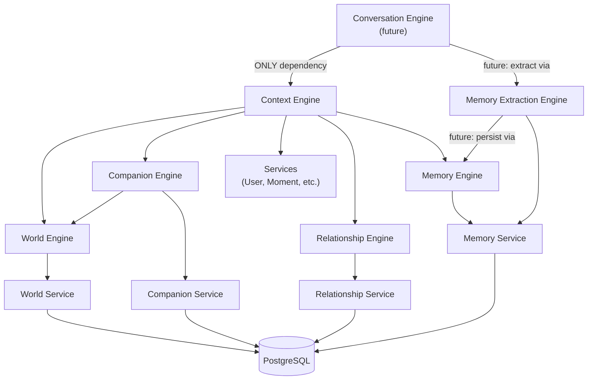
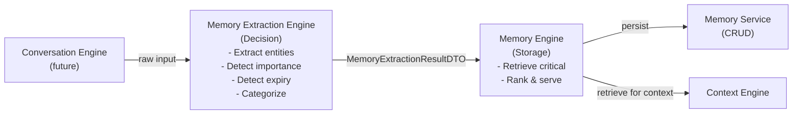

# Core Engines

The **Engines** layer is where Featherlight's business logic lives. Engines are
independent, deterministic systems that orchestrate domain concepts without
touching Prisma, HTTP, or external services directly.

Each engine is a composition of services, encapsulated strategies, and domain
rules. Engines speak to each other through well-defined interfaces.

---

## Engine Overview

| Engine                  | Purpose                                          | Responsibility |
|-------------------------|--------------------------------------------------|-----------------|
| **World Engine**        | Generate and manage the user's living world      | Deterministic world state, 70-20-10 rule |
| **Companion Engine**    | Manage companion life-state                      | Life state resolution, transitions, moods |
| **Relationship Engine** | Manage relationship state between user & companion | Relationship snapshots, storage & retrieval |
| **Memory Engine**       | Retrieve critical memories for conversation      | Memory retrieval & ranking (storage only) |
| **Memory Extraction Engine** | Extract & classify memories from events    | Entity extraction, importance, categorization |
| **Context Engine**      | Assemble complete conversation runtime context  | Provider orchestration, degradation policy |

---

## Diagram 1 — Core engines architecture



---

## Diagram 2 — Memory engines flow (Extraction → Storage)



---

## Folder structure

```
src/engines/
├── world/                   # World generation (deterministic, 70-20-10)
│   ├── interfaces/
│   ├── dtos/
│   ├── enums/
│   ├── context/
│   ├── builder/
│   ├── scheduler/
│   ├── strategies/
│   ├── selectors/
│   └── ...
├── companion/               # Companion life-state
│   ├── interfaces/
│   ├── dtos/
│   ├── enums/
│   ├── context/
│   ├── state/
│   ├── scheduler/
│   ├── transitions/
│   ├── managers/
│   ├── registry/
│   ├── rules/
│   └── ...
├── relationship/            # User-companion relationship
│   ├── interfaces/
│   ├── dtos/
│   ├── enums/
│   └── relationship.factory.ts
├── memory/                  # Memory retrieval (storage layer)
│   ├── interfaces/
│   ├── dtos/
│   └── memory.factory.ts
├── memory-extraction/       # Memory decision logic
│   ├── interfaces/
│   ├── dtos/
│   ├── enums/
│   └── memory-extraction.factory.ts
├── context/                 # Context assembly (aggregation boundary)
│   ├── interfaces/
│   ├── dtos/
│   ├── providers/
│   ├── builder/
│   ├── context.factory.ts
│   └── ...
└── README.md
```

---

## Design Principles

### 1. Single Responsibility
Each engine owns one concern (world, companion, relationship, memory, context).
Engines do not stray into others' domains.

### 2. Deterministic (No Random Choice)
Engines use seeded PRNGs, deterministic rules, and business logic — never
`Math.random()`. All state is reproducible.

### 3. Service Delegation
Engines orchestrate services but **never** touch Prisma directly. Services
handle CRUD; engines handle business logic.

### 4. Boundary Enforcement
- **Conversation Engine** sees **only** Context Engine.
- **Context Engine** aggregates from World, Companion, Relationship, Memory,
  and Services.
- Memory flow: Extraction Engine (decides) → Memory Engine (stores) → Service
  (persists).

### 5. Graceful Degradation
Optional providers fail without aborting. Required providers abort the build.
Every provider reports its health via `meta.degraded[]`.

### 6. Provider Pattern
Context Engine uses one provider per source. Each provider:
- Maps upstream DTOs to curated slices.
- Handles absence (empty vs. error).
- Reports availability.

---

## Testing

All engines are independently testable via mocked services and sub-components.

- **Unit tests**: Individual providers, selectors, rules.
- **Integration tests**: Full engine assembly with mocked services.
- **End-to-end tests**: Real providers over mocked upstream sources.

Example:
```typescript
// Test with mocked services
const { engine } = buildEngine({
  serviceOverrides: {
    userService: mockUserService(Result.failure(new Error('db down'))),
  },
});

// Expect graceful degradation
const result = await engine.assembleContext(request);
expect(result.isSuccess).toBe(false); // required provider failed
```

---

## Future Work

1. **Memory Extraction Implementation**: Add entity extraction, importance
   scoring, and expiry rules. (No LLM logic in scaffold.)
2. **Memory Engine Implementation**: Bridge to Memory Service; add ranking,
   recall scoring, decay.
3. **Conversation Engine**: Consume Context Engine exclusively.
4. **Additional Engines**: Dream Engine, Notification Engine, etc.
