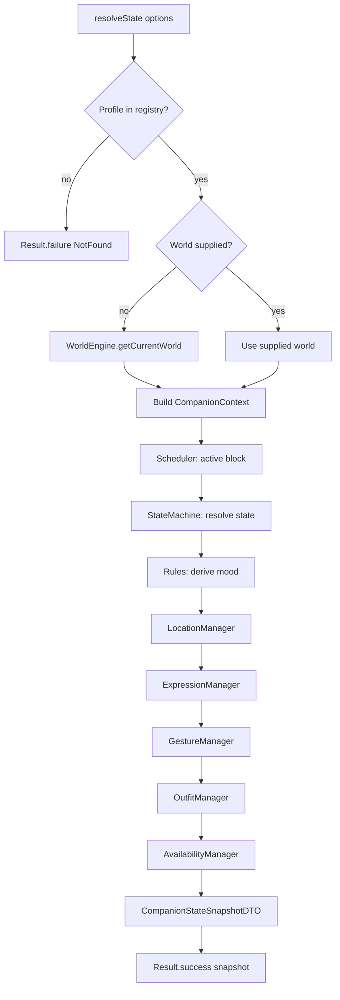
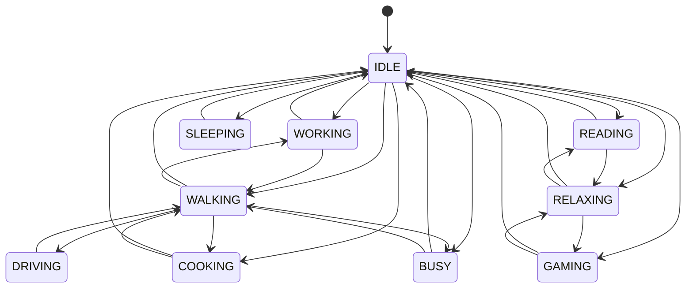
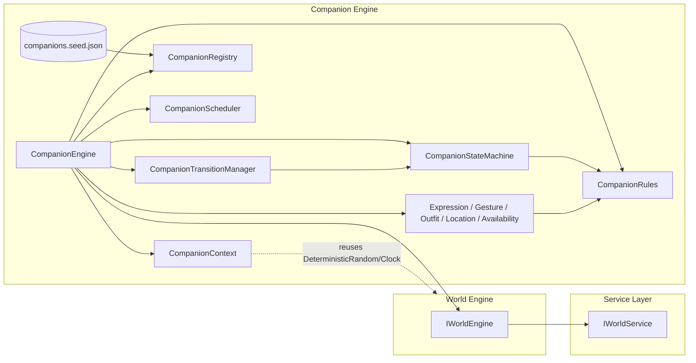

# Companion Engine

The **Companion Engine** manages the *life* of a companion — what they are
doing, how they feel, how they look, and how reachable they are — for **any**
number of companions. Kai and Kia are simply the first two seeded profiles.

This engine does **not** generate AI conversations. It never produces replies,
never calls an LLM, and never touches Prisma or HTTP. It speaks only to the
**World Engine** (to synchronize with the environment) and to the **service
layer**.

---

## Core principles

### 1. Data-driven companions — no hardcoded names

A companion is a **profile**: identity + schedule + preferences. Profiles are
pure data loaded from seed data (`seed/companions.seed.json`) into the
`CompanionRegistry`. Adding a new companion is a data operation — **no engine
code changes**. The strings "Kai" and "Kia" appear only in the seed file.

### 2. Deterministic — never random values

Everything the engine resolves depends on **world state, time, weather,
activity, relationship, and schedule** — never `Math.random()`. Where two
outcomes are equally valid, a single **salted, seeded** draw (reused from the
World Engine's `DeterministicRandom`) breaks the tie reproducibly. The
companion seed combines the companion id with the world seed, so a companion is
stable for a given day yet distinct from others sharing the same world.

### 3. Synchronized with the world

The companion lives *inside* its world. The engine pulls the current
`GeneratedWorldDTO` from the World Engine and synchronizes against it:

| World facet | Influences |
| ----------- | ---------- |
| activity    | fallback life-state when the schedule is silent |
| scene       | boosts the matching companion location |
| weather     | confines outdoor states/locations indoors |
| outfit      | baseline for the companion's outfit |
| mode        | special moments dress the companion festively |
| mood        | seeds the companion's mood palette |
| timeOfDay   | schedule interpretation, gestures, mood |

---

## Resolution pipeline

Each step is deterministic and may read everything resolved above it:

```
world (synced)
  └─ schedule block   (CompanionScheduler: which block covers this hour)
     └─ state            (CompanionStateMachine: schedule ∩ world ∩ constraints)
        └─ mood             (CompanionRules: world mood + personality + time)
           └─ location         (LocationManager: state + world scene + weather)
              └─ expression       (ExpressionManager: mood + state + weather)
                 └─ gesture          (GestureManager: state + location + time)
                    └─ outfit           (OutfitManager: world outfit + state + location)
                       └─ availability     (AvailabilityManager: state + mood + status)
```

The output is a `CompanionStateSnapshotDTO` — the companion's live life-state.

---

## Components

| Component                     | Responsibility                                                     |
| ----------------------------- | ------------------------------------------------------------------ |
| `CompanionEngine`             | Public facade; runs the pipeline, syncs the world.                 |
| `CompanionContext`            | Immutable input; binds profile + world + time; salted RNG factory. |
| `CompanionRegistry`           | Source of truth for profiles (seed data).                          |
| `CompanionRules`              | World-sync mappings + mood derivation (data-driven policy).        |
| `CompanionStateMachine`       | Legal state graph + intended-state resolver.                       |
| `CompanionScheduler`          | Which schedule block is active; next block start.                  |
| `CompanionTransitionManager`  | Smooths jumps between states along legal edges.                    |
| `ExpressionManager`           | Facial expression from mood + state.                               |
| `GestureManager`              | Body gesture from state + location.                                |
| `OutfitManager`               | Outfit from world outfit + state + location.                       |
| `LocationManager`             | Location from state + world scene + weather.                       |
| `AvailabilityManager`         | Reachability from state + mood + status.                           |
| `CompanionFactory`            | Composition root / dependency injection.                           |

Every manager, the rules, the state machine, the scheduler, the transition
manager, and the registry each sit behind an **interface**, so a single facet's
policy can be swapped without touching the rest.

---

## Diagram 1 — Companion Lifecycle



---

## Diagram 2 — State Machine

Legal direct transitions between life-states. Movement generally passes through
`IDLE` or `WALKING`; `DRIVING` is reachable only via `WALKING`. The transition
manager uses shortest paths over this graph to step one believable hop at a
time.



---

## Diagram 3 — Dependency Graph

The Companion Engine depends on the World Engine and the service layer; nothing
depends back on it. Managers depend on rules; the engine composes everything.



---

## Seed data

`seed/companions.seed.json` defines the seeded companions. Each entry is a full
profile:

- **identity**: name, displayName, avatar, voice, gender, ageRange, biography
- **schedule**: labelled `[startHour, endHour)` blocks (may wrap past midnight)
  mapping hours to a life-state (and optional location)
- **preferences**: chronotype, personality axes (playfulness / focus / warmth /
  energy in [0, 1]), favourite activities, preferred outfits

**Kai** is a focused morning person (early coffee, deep work, calm evenings).
**Kia** is a playful night owl (slow mornings, creative afternoons, late-night
gaming and reading). Their differing personalities and schedules make the *same
world* produce distinctly different companions — with zero code specific to
either of them.

New companions are added by appending to this JSON (or registering a profile at
runtime via `CompanionRegistry.register`). The engine requires no changes.

---

## Usage

```typescript
import { getCompanionEngine } from '@engines/companion';

const engine = getCompanionEngine();

// Full life-state, synchronized with the companion's world:
const snapshot = await engine.resolveState({
  companionId: 'companion-seed-kai',
  timezone: 'Asia/Kolkata',
});

// Just availability, or the active schedule block:
const availability = await engine.getAvailability({ companionId });
const block = await engine.getCurrentScheduleBlock({ companionId });

// Plan a believable transition from a previously observed state:
const transition = await engine.planTransition({
  companionId,
  previousState: 'DRIVING',
});

// Registry access (profiles / preferences):
const profiles = engine.listCompanions();
const prefs = engine.getPreferences(companionId);
```

For tests, inject a `FixedClock`, a mock `IWorldEngine`, and/or a custom
`CompanionRegistry` via `getCompanionEngine({ clock, worldEngine, registry })`,
or construct `CompanionEngine` directly with its dependency bag.

---

## Testing

Seven suites, 66 tests:

- `companion-rules.test.ts` — world-sync mappings, confining weather, mood
  determinism and validity.
- `companion-scheduler.test.ts` — block resolution (incl. midnight wrap), next
  block.
- `state-machine.test.ts` — transitions, connectivity, shortest paths, and
  state resolution (schedule / world / weather / override).
- `transition-manager.test.ts` — direct, indirect (one-hop), and no-op plans.
- `managers.test.ts` — each manager's rules and determinism.
- `companion-registry.test.ts` — registry operations + seed loading.
- `companion.engine.test.ts` — end-to-end resolution with a mocked World Engine,
  determinism, world sync, availability, transitions, and error paths.
