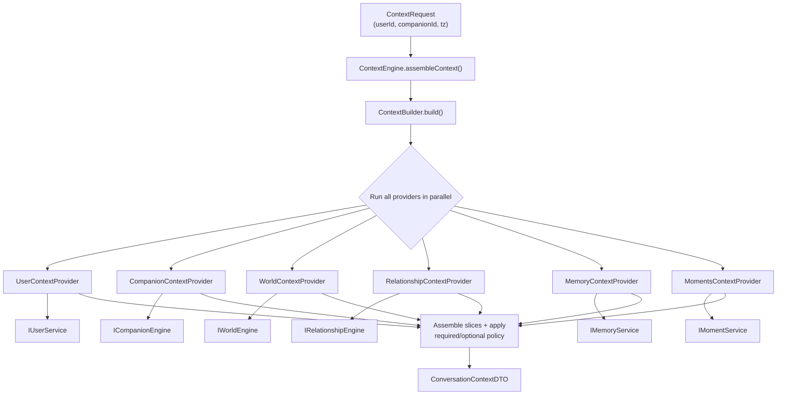
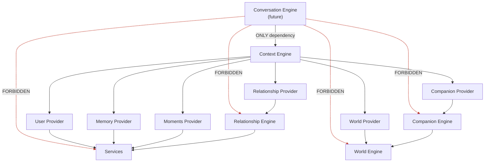
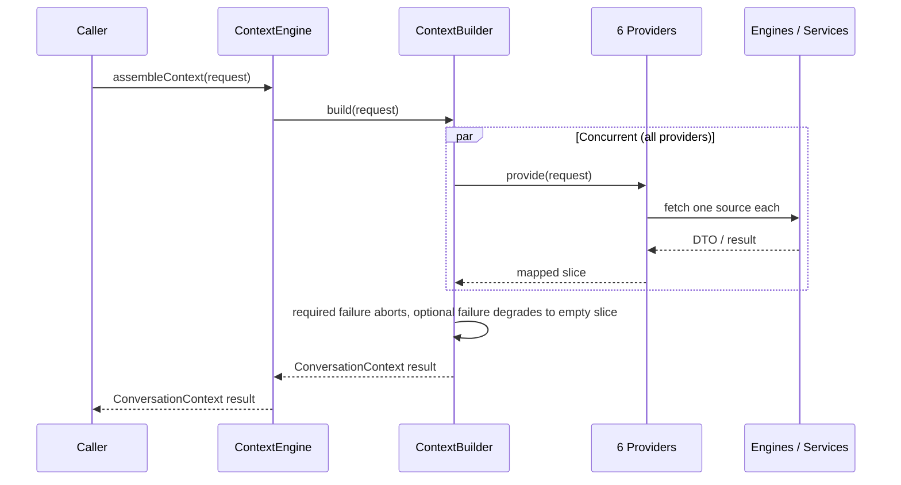

# Context Engine

The **Context Engine** assembles the complete runtime context required by the
(future) **Conversation Engine** and hands it back as a single
`ConversationContextDTO`.

Its reason for existing is an architectural boundary:

> The Conversation Engine must **never** communicate directly with the World
> Engine, Companion Engine, Relationship Engine, Memory/Moment sources, or any
> service. It receives **only** a `ConversationContext` object.

The Context Engine is the one place that fans out to every source, so the
conversation tier depends on exactly one collaborator.

---

## Responsibilities

- Own the `ConversationContextDTO` contract (the single object handed downstream).
- Run one **provider per source**, each mapping its source into a curated slice.
- Orchestrate providers concurrently, time them, and degrade gracefully.
- Never contain business logic — it aggregates, it does not decide.

Providers depend on engine interfaces (`IWorldEngine`, `ICompanionEngine`,
`IRelationshipEngine`) and service interfaces (`IUserService`, `IMemoryService`,
`IMomentService`) via constructor injection.

---

## Providers — one source each

| Provider                        | Source                       | Required | Absence handling |
| ------------------------------- | ---------------------------- | :------: | ---------------- |
| `UserContextProvider`           | `IUserService`               |    ✔     | missing user → build aborts |
| `CompanionContextProvider`      | `ICompanionEngine`           |    ✔     | failure → build aborts |
| `WorldContextProvider`          | `IWorldEngine`               |    ✔     | failure → build aborts |
| `RelationshipContextProvider`   | `IRelationshipEngine`        |          | not-found → empty slice |
| `MemoryContextProvider`         | `IMemoryService`             |          | error → degrade |
| `MomentsContextProvider`        | `IMomentService`             |          | error → degrade |

**Degradation policy:** a *required* provider failing aborts the whole build; an
*optional* provider failing falls back to its `emptySlice()` and is recorded in
`meta.degraded`. A slice's `available` flag distinguishes *known-empty*
(`available: true, count: 0`) from *degraded/unknown* (`available: false`).

**Consistency:** because world generation is deterministic, the world and
companion providers resolve the same world independently. A caller may also pin
a specific world via `ContextRequest.world`, which both providers then use.

---

## Diagram 1 — Context assembly pipeline



---

## Diagram 2 — Refactored dependency graph

The Conversation Engine is **decoupled** from every source. Its only dependency
is the Context Engine; the forbidden direct edges are removed.



The red, crossed edges (`Conversation Engine -> World/Companion/Relationship/Services`)
are what this refactor **eliminates**. Everything now flows through the Context
Engine.

---

## Diagram 3 — Assembly sequence



---

## The context object

```
ConversationContextDTO
├── requestId, userId, companionId, generatedAt
├── user          UserContextSlice          (id, username, displayName, role, tz, lang)
├── companion     CompanionContextSlice     (state, mood, expression, gesture, location, outfit, availability)
├── world         WorldContextSlice         (scene, timeOfDay, season, weather, activity, lighting, ambient, mood)
├── relationship  RelationshipContextSlice  (status, level, affection, trust, familiarity, interactions)
├── memories      MemoryContextSlice        (count, items[{ id, type, importance, content }])
├── moments       MomentsContextSlice       (count, items[{ id, title, description, significance, occurredAt }])
└── meta          ContextMeta               (timezone, referenceDate, degraded[], providers[], buildDurationMs)
```

---

## Usage

```typescript
import { getContextEngine } from '@engines/context';

const contextEngine = getContextEngine();

const result = await contextEngine.assembleContext({
  userId,
  companionId,
  timezone: 'Asia/Kolkata',
});

if (result.isSuccess) {
  const context = result.value; // ConversationContextDTO
  // → hand ONLY this to the Conversation Engine.
}
```

For tests, inject mocked sources / a `FixedClock` via
`getContextEngine({ services, worldEngine, companionEngine, relationshipEngine, clock })`,
or build a provider set directly with
`buildProviderSet(services, worldEngine, companionEngine, relationshipEngine)`.

---

## Testing

Three suites, 22 tests:

- `providers.test.ts` — each provider's mapping + absence/error semantics.
- `context.builder.test.ts` — orchestration policy: full assembly, required-abort,
  optional-degrade, thrown-provider capture, and meta/reporting.
- `context.engine.test.ts` — end-to-end assembly with real providers over mocked
  sources, provider keys, world threading, and degradation.
