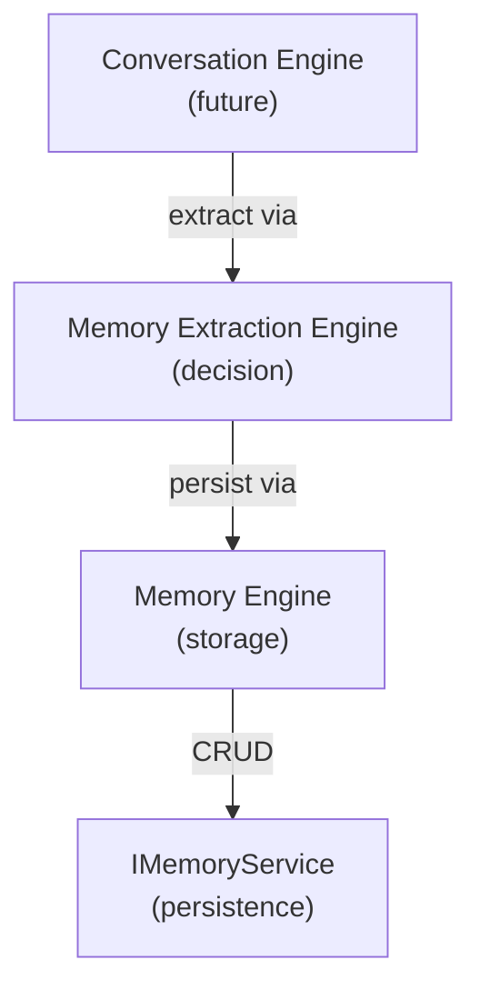

# Memory Extraction Engine

The **Memory Extraction Engine** is responsible for analyzing conversations and
events to identify, classify, and extract salient memories. It is the **decision
layer** for memory management.

It **never persists** — it only produces validated memory records. The Memory
Engine handles persistence.

---

## Responsibilities

- **Extract entities** from conversation input and events.
- **Detect importance** — classify memories as LOW, MEDIUM, HIGH, or CRITICAL.
- **Detect expiry** — assign lifetime (PERMANENT, LONG_TERM, MEDIUM_TERM, SHORT_TERM, EPHEMERAL).
- **Categorize memories** — assign one or more categories (USER_PROFILE, PREFERENCES, HABITS, RELATIONSHIPS, MILESTONES, CONVERSATIONS, EXPERIENCES, EMOTIONS).
- **Produce MemoryExtractionResultDTO** with a validated list of extracted memories.
- **No LLM logic in scaffolding** — inference layer is future work.

---

## Interface

```typescript
export interface IMemoryExtractionEngine {
  extractMemories(
    input: MemoryExtractionInputDTO
  ): Promise<IResult<MemoryExtractionResultDTO>>;
}
```

---

## Enums

- `MemoryType`: FACT, PREFERENCE, MILESTONE, EVENT, EMOTION, RELATIONSHIP
- `MemoryImportance`: LOW, MEDIUM, HIGH, CRITICAL
- `MemoryExpiry`: PERMANENT, LONG_TERM, MEDIUM_TERM, SHORT_TERM, EPHEMERAL
- `MemoryCategory`: USER_PROFILE, PREFERENCES, HABITS, RELATIONSHIPS, MILESTONES, CONVERSATIONS, EXPERIENCES, EMOTIONS

---

## Diagram 1 — Memory engines in the engine layer



---

## Folder structure

```
src/engines/memory-extraction/
├── dtos/
│   └── memory-extraction.dto.ts    # Input/output DTOs
├── enums/
│   └── memory-extraction.enums.ts  # MemoryType, Importance, Expiry, Category
├── interfaces/
│   └── memory-extraction-engine.interface.ts  # IMemoryExtractionEngine
├── memory-extraction.factory.ts    # DI factory
├── index.ts                        # Barrel exports
└── README.md
```

---

## Usage (future)

```typescript
import { getMemoryExtractionEngine } from '@engines/memory-extraction';

const engine = getMemoryExtractionEngine();

const result = await engine.extractMemories({
  userId: 'user-1',
  companionId: 'companion-1',
  content: 'User mentioned they love coffee in the morning.',
  context: { timestamp: new Date() },
});

if (result.isSuccess) {
  const extraction = result.value;
  // extraction.memories = [
  //   {
  //     type: MemoryType.PREFERENCE,
  //     importance: MemoryImportance.MEDIUM,
  //     expiry: MemoryExpiry.LONG_TERM,
  //     category: MemoryCategory.PREFERENCES,
  //     content: 'Loves coffee in the morning',
  //     entities: ['coffee', 'morning'],
  //     confidence: 0.95,
  //   }
  // ]
}
```
