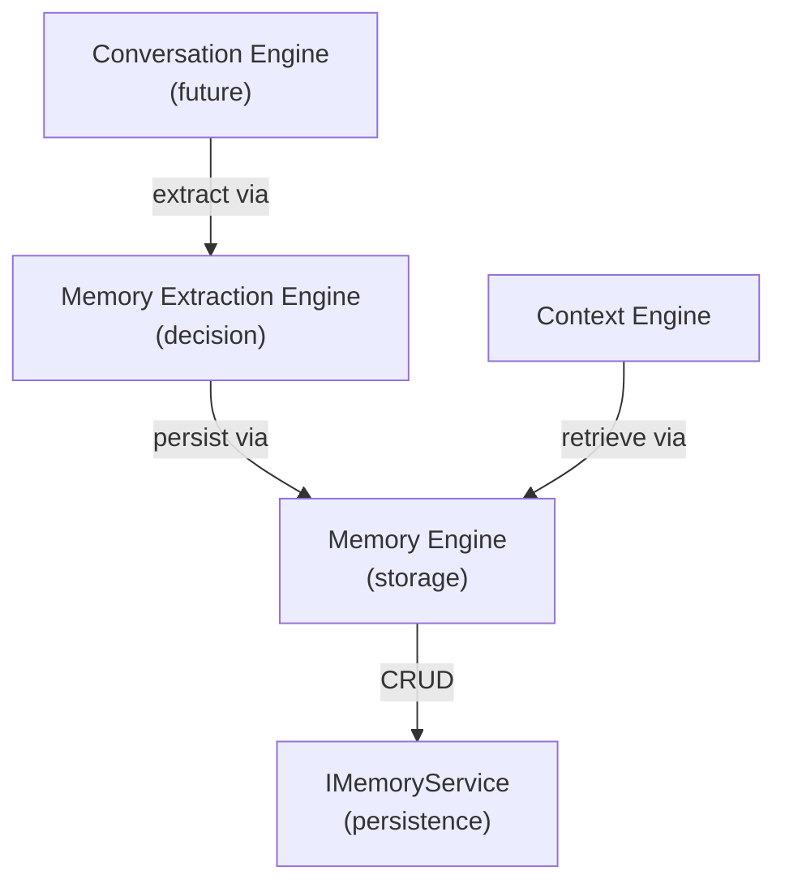

# Memory Engine

The **Memory Engine** is the storage and retrieval layer for memories. It
handles persistence and query operations, delegating all CRUD to the
`IMemoryService` in the service layer.

It **does not decide** what to save or how to extract importance — those
responsibilities belong to the Memory Extraction Engine.

---

## Responsibilities

- Own the `IMemoryEngine` contract — the public interface consumed by the
  Context Engine and (future) Conversation Engine.
- Expose retrieval methods: `getCriticalMemories()`, `getMemoryById()`.
- Delegate all persistence operations to `IMemoryService`.
- Never access Prisma or HTTP directly — it speaks only to the Memory Service.

This is an **architecture-only scaffold**: the interface and factory are defined.
Implementation will bridge the service layer.

---

## Interface

```typescript
export interface IMemoryEngine {
  getCriticalMemories(
    options: RetrieveCriticalMemoriesOptions
  ): Promise<IResult<CriticalMemoriesSliceDTO>>;

  getMemoryById(memoryId: string): Promise<IResult<MemorySnapshotDTO | null>>;
}
```

---

## Diagram 1 — Memory engines in the engine layer



---

## Folder structure

```
src/engines/memory/
├── dtos/
│   └── memory-engine.dto.ts        # MemorySnapshotDTO, retrieval DTOs
├── interfaces/
│   └── memory-engine.interface.ts  # IMemoryEngine contract
├── memory.factory.ts               # DI factory
├── index.ts                        # Barrel exports
└── README.md
```

---

## Usage (future)

```typescript
import { getMemoryEngine } from '@engines/memory';

const engine = getMemoryEngine();

const result = await engine.getCriticalMemories({
  companionId: 'companion-1',
  limit: 10,
});

if (result.isSuccess) {
  const slice = result.value; // CriticalMemoriesSliceDTO
}
```
