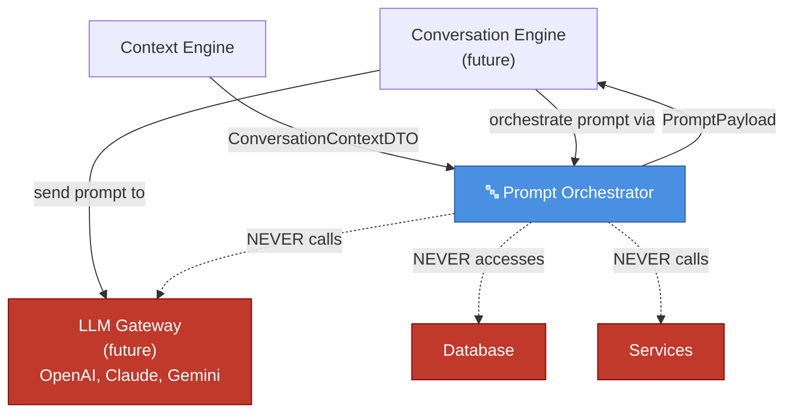
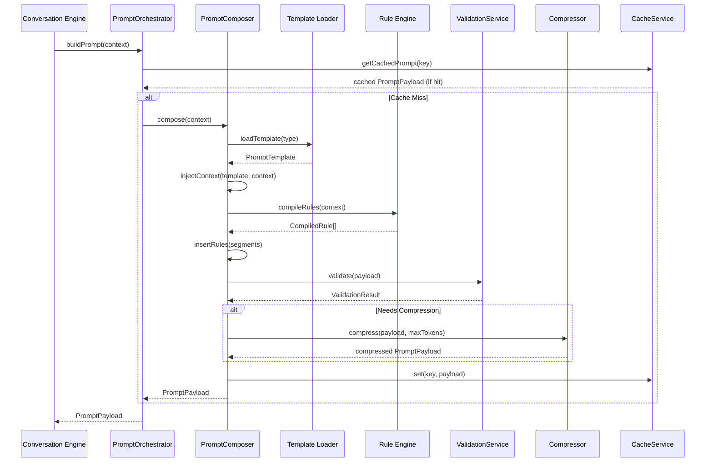
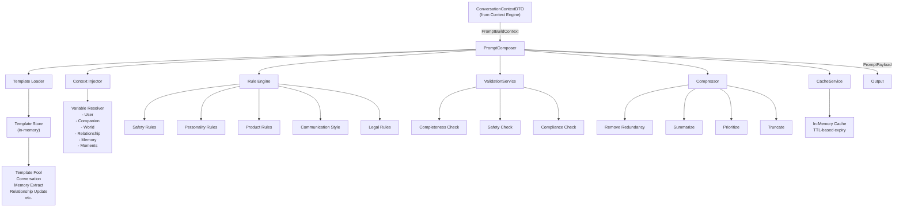

# Prompt Orchestrator

The **Prompt Orchestrator** is responsible for orchestrating the complete prompt
construction pipeline for any LLM provider. It is **completely independent** from
OpenAI, Claude, Gemini, or any other AI model.

Its only responsibility is to **orchestrate prompt construction**, never to **call LLMs**.

---

## Core Responsibility

> The Prompt Orchestrator receives a `ConversationContextDTO` and produces a
> `PromptPayload` containing system, developer, and user prompts. It never
> reaches to the database, never calls services, and never touches any LLM API.

---

## Responsibilities

### Prompt Construction
- Build system prompts (instructions for the model)
- Build developer prompts (implementation guidance)
- Build user prompts (user input + context)

### Context Injection
- Inject world context (scene, weather, time of day, mood)
- Inject companion context (state, mood, location, availability)
- Inject user context (username, preferences, language)
- Inject relationship context (level, affection, trust)
- Inject memory context (critical memories ranked by importance)
- Inject moments context (recent shared moments)
- Inject conversation context (conversation history)

### Rules & Safety
- Enforce product rules (feature gates, restrictions)
- Apply safety rules (content filters, harm prevention)
- Apply personality rules (voice, tone, character traits)
- Apply communication style (formal, casual, empathetic)
- Validate compliance before returning

### Token Management
- Apply token budgeting (respect max_tokens parameter)
- Compress prompts when necessary (multiple levels)
- Track token counts per segment
- Provide compression statistics

### Versioning & Caching
- Support multiple prompt template versions (A/B testing)
- Cache compiled prompts (avoid recomputation)
- Track cache hits/misses
- Provide metrics for optimization

---

## Diagram 1 — Prompt Orchestrator in the system



---

## Diagram 2 — Prompt orchestration pipeline



---

## Diagram 3 — Prompt Orchestrator architecture



---

## Interfaces

### IPromptOrchestrator

```typescript
interface IPromptOrchestrator {
  buildPrompt(context: PromptBuildContext): Promise<IResult<PromptPayload>>;
  getCachedPrompt(cacheKey: string): Promise<IResult<PromptPayload | null>>;
  getAnalytics(templateId: string): Promise<IResult<PromptAnalytics[]>>;
}
```

### IPromptComposer

Composes the entire prompt construction pipeline:
1. Load template
2. Inject context (world, companion, relationship, memory, moments, user)
3. Apply rules (safety, personality, product, style)
4. Validate completeness and compliance
5. Compress if needed
6. Cache the result

### IPromptValidationService

Validates:
- All required context is present
- No safety rule violations
- Compliance with product rules
- Correct role assignment

### IPromptCompressor

Compresses using strategies:
- **NONE**: No compression
- **LIGHT**: Remove redundancy, deduplicate
- **MODERATE**: Summarize non-critical sections
- **AGGRESSIVE**: Prioritize by importance, truncate

### IPromptCacheService

In-memory cache with TTL:
- Get/set/invalidate
- Track hits/misses
- Automatic expiry

---

## Data Flow

```
ConversationContextDTO
    ↓
PromptBuildContext
    ↓
PromptComposer.compose()
    ├─→ PromptTemplate (from loader)
    ├─→ Inject Context (user, companion, world, relationship, memory, moments)
    ├─→ Apply Rules (safety, personality, product, style)
    ├─→ Validate (completeness, safety, compliance)
    ├─→ Compress (if token budget exceeded)
    └─→ Cache (store compiled result)
    ↓
PromptPayload
    ├── systemPrompt: PromptSegment
    ├── developerPrompt?: PromptSegment
    ├── userPrompt: PromptSegment
    ├── rules: CompiledRule[]
    ├── validation: ValidationResult
    ├── analytics: PromptAnalytics
    └── cached: boolean
    ↓
Ready to send to LLM Gateway
```

---

## Enums

### PromptRole
- SYSTEM — System/instruction prompt
- DEVELOPER — Implementation guidance
- USER — User input + context
- ASSISTANT — (For multi-turn, future)

### PromptType
- CONVERSATION — Main conversation
- MEMORY_EXTRACTION — Extract memories from events
- RELATIONSHIP_UPDATE — Relationship progression
- RECOMMENDATION — Generate recommendations
- MOMENT_CREATION — Create shared moments
- COMPANION_RESPONSE — Generate companion reply
- SAFETY_CHECK — Content safety validation

### PromptStrategy
- STANDARD — Balanced, default approach
- DETAILED — Comprehensive, include all context
- CONCISE — Minimal, only essentials
- EMOTIONAL — Emphasize feelings and personality
- ANALYTICAL — Logical, data-driven

### RuleCategory
- SAFETY — Content safety, harm prevention
- PERSONALITY — Character traits, voice, tone
- COMMUNICATION_STYLE — Formal, casual, empathetic
- PRODUCT — Feature gates, restrictions
- LEGAL — Privacy, legal disclaimers

### CompressionLevel
- NONE → No compression
- LIGHT → Remove redundancy
- MODERATE → Summarize non-critical
- AGGRESSIVE → Prioritize by importance

---

## Folder Structure

```
src/engines/prompt/
├── interfaces/
│   ├── prompt-orchestrator.interface.ts      # IPromptOrchestrator
│   ├── prompt-composer.interface.ts          # IPromptComposer
│   ├── prompt-assembly-strategy.interface.ts # IPromptAssemblyStrategy
│   ├── prompt-validation-service.interface.ts# IPromptValidationService
│   ├── prompt-compressor.interface.ts        # IPromptCompressor
│   └── prompt-cache-service.interface.ts     # IPromptCacheService
├── dtos/
│   └── prompt.dtos.ts                        # All DTOs
├── enums/
│   └── prompt.enums.ts                       # All enums
├── composers/
│   ├── prompt-composer.ts                    # Main composer
│   ├── template-loader.ts                    # Template loading
│   └── context-injector.ts                   # Context injection
├── templates/
│   ├── conversation.template.ts              # Conversation prompt template
│   ├── memory-extraction.template.ts         # Memory extraction template
│   ├── relationship.template.ts              # Relationship update template
│   └── ...
├── rules/
│   ├── safety.rules.ts                       # Safety rules definitions
│   ├── personality.rules.ts                  # Personality rules
│   ├── product.rules.ts                      # Product rules
│   ├── communication-style.rules.ts          # Communication style
│   └── rule-engine.ts                        # Rule compilation & injection
├── strategies/
│   ├── standard.strategy.ts                  # Standard assembly strategy
│   ├── detailed.strategy.ts                  # Detailed assembly strategy
│   ├── concise.strategy.ts                   # Concise assembly strategy
│   └── ...
├── compressor/
│   └── prompt-compressor.ts                  # Compression logic
├── validator/
│   └── prompt-validation-service.ts          # Validation logic
├── cache/
│   └── prompt-cache-service.ts               # In-memory cache
├── prompt-orchestrator.ts                    # Main orchestrator class
├── prompt-orchestrator.factory.ts            # DI factory
├── index.ts                                  # Barrel exports
└── README.md
```

---

## Usage Example

```typescript
import { getPromptOrchestrator } from '@engines/prompt';
import { PromptType, PromptStrategy, CompressionLevel } from '@engines/prompt';

const promptOrchestrator = getPromptOrchestrator();

// Orchestrate prompt construction from conversation context
const result = await promptOrchestrator.buildPrompt({
  conversationContext: contextDTO,
  promptType: PromptType.CONVERSATION,
  strategy: PromptStrategy.DETAILED,
  maxTokens: 2000,
  compressionLevel: CompressionLevel.MODERATE,
});

if (result.isSuccess) {
  const promptPayload = result.value;
  
  // promptPayload contains:
  // - systemPrompt: PromptSegment (instructions)
  // - developerPrompt?: PromptSegment (optional implementation guidance)
  // - userPrompt: PromptSegment (user input + injected context)
  // - rules: CompiledRule[] (safety, personality, product rules)
  // - validation: ValidationResult (pass/fail + errors)
  // - analytics: PromptAnalytics (tracking for monitoring)
  
  // Now ready to send to LLM Gateway:
  // const response = await llmGateway.send({
  //   messages: [
  //     { role: 'system', content: promptPayload.systemPrompt.content },
  //     { role: 'user', content: promptPayload.userPrompt.content },
  //   ],
  //   max_tokens: promptPayload.totalTokens,
  // });
}
```

---

## Design Principles

### 1. **LLM Provider Independence**
The Prompt Orchestrator orchestrates prompt construction only. It never calls
OpenAI, Claude, Gemini, or any other LLM. The caller (future Conversation Engine)
is responsible for sending the prompt to the chosen LLM Gateway.

### 2. **Context-Only Consumption**
Receives only `ConversationContextDTO`. Never accesses repositories, services,
databases, or other engines. Pure function of context.

### 3. **Composable Segments**
Prompts are built as modular segments (system, developer, user), each with:
- Content
- Role
- Order
- Token count
- Compression flag

### 4. **Declarative Rules**
Rules are defined declaratively (category, severity, statement) and compiled
before injection. New rule types can be added without code changes.

### 5. **Token-Aware**
Every segment tracks token count. Compression respects budget constraints and
reports compression ratio + technique used.

### 6. **Observable**
Every build produces metrics (template ID, strategy, tokens, rules, duration).
Enables A/B testing, monitoring, and optimization.

---

## Future Work

1. **Implement template library** — Conversation, Memory Extraction, Relationship, etc.
2. **Implement rule engine** — Compile and inject safety, personality, product rules
3. **Implement compressor** — Multiple compression strategies
4. **Implement validation service** — Completeness, safety, compliance checks
5. **Connect to Conversation Engine** — Receive context, send PromptPayload
6. **Telemetry** — Track analytics for A/B testing and optimization
