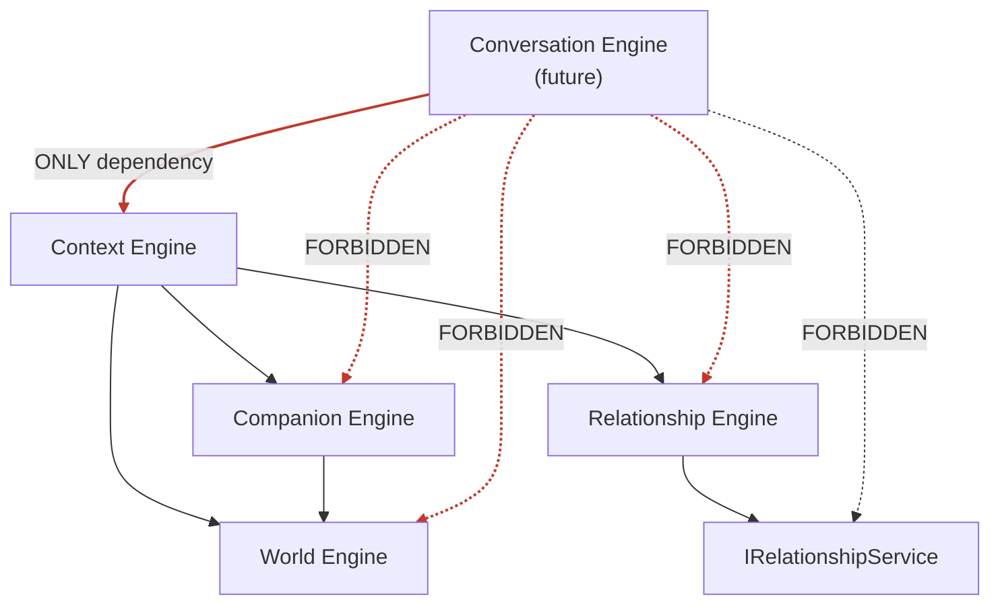
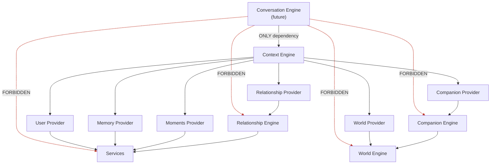

# Relationship Engine

The **Relationship Engine** is the core engine responsible for managing the
**relationship state** between a user and a companion. It sits in the engine
layer alongside the World Engine, Companion Engine, and Context Engine.

Its reason for existing is an architectural boundary:

> The Context Engine (and by extension, the Conversation Engine) must **never**
> access the Relationship Service directly. All relationship data flows through
> the Relationship Engine.

The Relationship Engine is the single entry point for relationship-aware
operations. It delegates persistence to the `IRelationshipService` in the
service layer.

---

## Responsibilities

- Own the `IRelationshipEngine` contract — the public interface consumed by
  the Context Engine.
- Expose the current relationship snapshot for a user-companion pair via
  `getRelationshipSnapshot()`.
- Serve as the future home for relationship business logic: progression,
  decay, milestone detection, score computation, and relationship-event
  processing.
- Never access Prisma, HTTP, or any external system directly — it speaks only
  to services.

This is an **architecture-only scaffold**: the interface and factory are defined
so the dependency graph is correct. Implementation will be added when
relationship business logic is built.

---

## Interface

```typescript
export interface IRelationshipEngine {
  getRelationshipSnapshot(
    options: ResolveRelationshipOptions
  ): Promise<IResult<RelationshipSnapshotDTO>>;
}
```

---

## Diagram 1 — Relationship Engine in the engine layer



---

## Diagram 2 — Full dependency graph (updated)



The red, crossed edges (`Conversation Engine -> World/Companion/Relationship/Services`)
are what the architecture **eliminates**. Everything flows through the Context Engine.

---

## Folder structure

```
src/engines/relationship/
├── dtos/
│   └── relationship-engine.dto.ts    # RelationshipSnapshotDTO, ResolveRelationshipOptions
├── enums/
│   └── relationship.enums.ts         # RelationshipLevel, RelationshipStatus
├── interfaces/
│   └── relationship-engine.interface.ts  # IRelationshipEngine contract
├── relationship.factory.ts           # DI factory (register / get / reset)
├── index.ts                          # Barrel exports
└── README.md
```

---

## Usage

```typescript
import { getRelationshipEngine } from '@engines/relationship';

const engine = getRelationshipEngine();

const result = await engine.getRelationshipSnapshot({
  userId: 'user-1',
  companionId: 'companion-1',
});

if (result.isSuccess) {
  const snapshot = result.value; // RelationshipSnapshotDTO
}
```

For tests, provide a mock implementation via the factory:

```typescript
import { getRelationshipEngine } from '@engines/relationship';

const mockEngine = {
  getRelationshipSnapshot: jest.fn().mockResolvedValue(Result.success(snapshot)),
};
const engine = getRelationshipEngine({ relationshipEngine: mockEngine });
```
