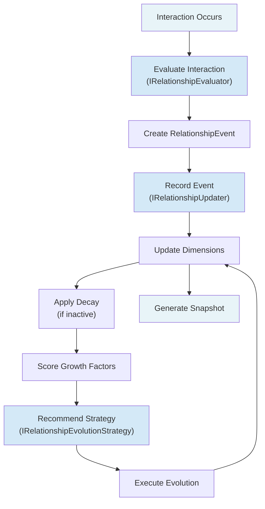
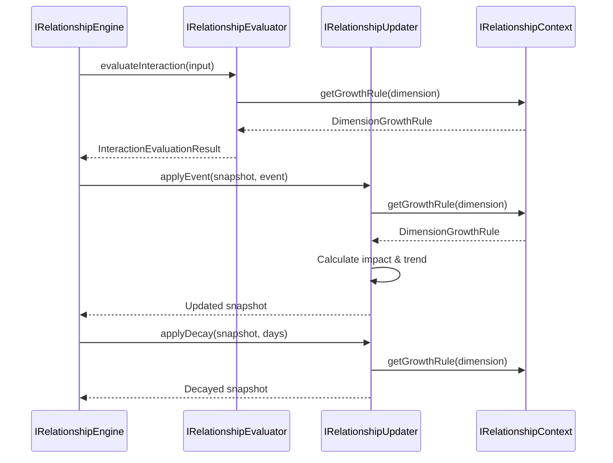

# Relationship Engine

The **Relationship Engine** models the evolving relationship between a user and
a companion across **12 independent dimensions** without a single score.

It is NOT an AI engine. It is NOT a scoring engine. It is a pure state-management
engine that tracks multi-dimensional relationship evolution based on deterministic,
measurable factors: conversation quality, frequency, meaningful events, shared
memories, time, interactions, repairs, and consistency.

---

## Core Principle

> There must never be a single relationship score, and there must never be a
> named, staged "relationship level" (no `STRANGER → ACQUAINTANCE → ... →
> BEST_FRIEND` ladder, no `phase`, no `tier`, no `milestone`). Relationships
> evolve across multiple independent dimensions: Trust, Comfort, Playfulness,
> Emotional Depth, Communication Style, Shared Rituals, Shared Memories,
> Boundaries, Familiarity, Reliability, Supportiveness, Respect.

Each dimension:
- Ranges from 0–100 (not a binary score)
- Has its own growth rules and decay rates
- Tracks change history and trend
- Evolves independently based on event impact

### Closeness is read, not stored

How "close" a relationship is is never encoded as a discrete stage. Instead,
`RelationshipSnapshot.closeness` (a `RelationshipClosenessSignals`) is
**computed live at query time** from raw, underlying data:

- `daysSinceFirstInteraction` — elapsed time since `firstInteractionAt`
- `totalInteractions` — count of recorded interactions
- `conversationFrequencyPerWeek` — `totalInteractions` normalized over elapsed
  time

Nothing here is persisted as a label. Two reads of the same relationship a
minute apart can return different `daysSinceFirstInteraction` values because
it is derived against `now`, not cached. Consumers that want a richer picture
of closeness (e.g. the prompt engine) combine these signals with the
continuous dimension values above and, separately, the consented memory count
from the Memory engine's own context slice — this engine does not duplicate
that count.

`status` (`ACTIVE` / `PAUSED` / `ENDED`) is a **lifecycle** flag, not a
closeness measure: it only changes via explicit action
(`RelationshipService.pauseRelationship` / `resumeRelationship` /
`endRelationship`), never as a side effect of dimension health. Deriving a
"DEVELOPING → ESTABLISHED → DEEPENING" status ladder from a health score would
just reintroduce the same staged-progression anti-pattern under a different
name, so the updater deliberately leaves `status` untouched.

---

## Responsibilities

1. **Create relationships** — Initialize new relationship state between user and
   companion with all 12 dimensions at starting values.

2. **Load relationships** — Retrieve existing relationship state with full
   snapshot and timeline.

3. **Evaluate interactions** — Determine interaction quality and calculate impact
   on affected dimensions using growth rules.

4. **Record events** — Apply events (conversations, shared moments, conflicts,
   repairs, etc.) to snapshots and update dimensions.

5. **Apply growth strategies** — Evolve relationships based on current state and
   growth factor scores.

6. **Generate snapshots** — Provide multi-dimensional state view showing all
   dimension values, health, trajectory, strengths, vulnerabilities.

7. **Maintain timeline** — Store and retrieve relationship history (all events).

8. **Apply decay** — Reduce dimension values for periods of inactivity.

---

## Architecture

### Five Core Interfaces

#### IRelationshipEngine
Main entry point. Methods:
- `createRelationship(userId, companionId)` → RelationshipState
- `getRelationship(userId, companionId)` → RelationshipState
- `evaluateInteraction(input)` → InteractionEvaluationResult
- `recordEvent(userId, companionId, event)` → RelationshipSnapshot
- `evolveRelationship(userId, companionId)` → RelationshipState
- `getSnapshot(userId, companionId)` → RelationshipSnapshot
- `getHistory(userId, companionId)` → RelationshipEvent[]

#### IRelationshipContext
Provides calculation context and growth rules:
- `getCalculationContext(userId, companionId, currentDate)` → RelationshipCalculationContext
- `getGrowthRules()` → DimensionGrowthRule[] (all 12)
- `getGrowthRule(dimension)` → DimensionGrowthRule (specific)

#### IRelationshipEvaluator
Deterministically evaluates interactions:
- `evaluateInteraction(input)` → InteractionEvaluationResult
- `scoreGrowthFactors(userId, companionId, context)` → GrowthFactorScore

#### IRelationshipUpdater
Applies events and decay to dimensions:
- `applyEvent(snapshot, event)` → RelationshipSnapshot
- `applyDecay(snapshot, daysSinceLastEvent)` → RelationshipSnapshot

#### IRelationshipEvolutionStrategy
Applies growth strategies:
- `execute(snapshot)` → RelationshipSnapshot
- `recommendStrategy(snapshot)` → EvolutionStrategy

### Dimension Growth Rules

Each dimension has:
- **Base growth rate** (per day)
- **Event impacts** (each event type has specific impact per dimension)
- **Quality multipliers** (SUPERFICIAL/CASUAL/ENGAGED/MEANINGFUL/PROFOUND)
- **Decay rate** (inactive penalty)
- **Bounds** (min/max values 0–100)

---

## Diagram 1 — Relationship Evolution Flow



---

## Diagram 2 — Dimension Update Pipeline



---

## Diagram 3 — Multi-Dimensional State

```
RelationshipSnapshot
├── Dimensions (12 independent)
│   ├── Trust: 75 ↗️ (trend +1)
│   ├── Comfort: 82 ↗️ (trend +2)
│   ├── Playfulness: 60 → (trend 0)
│   ├── Emotional Depth: 70 ↗️ (trend +1)
│   ├── Communication Style: 78 ↗️ (trend +1)
│   ├── Shared Rituals: 55 ↘️ (trend -1)
│   ├── Shared Memories: 85 → (trend 0)
│   ├── Boundaries: 72 → (trend 0)
│   ├── Familiarity: 88 ↗️ (trend +1)
│   ├── Reliability: 80 ↗️ (trend +1)
│   ├── Supportiveness: 77 ↗️ (trend +1)
│   └── Respect: 81 → (trend 0)
├── overallHealth: 72 (average of all dimensions)
├── trajectory: +1 (improving overall)
├── strengths: [Familiarity, Shared Memories, Comfort]
├── vulnerabilities: [Playfulness, Shared Rituals, Respect]
└── closeness: { daysSinceFirstInteraction: 214, totalInteractions: 156, conversationFrequencyPerWeek: 5.1 }
   (always read live — never stored as a named level/phase/tier)
```

---

## Folder Structure

```
src/engines/relationship/
├── context/
│   └── relationship.context.ts       # Provides calculation context & growth rules
├── evaluator/
│   └── relationship.evaluator.ts     # Evaluates interaction quality & impact
├── updater/
│   └── relationship.updater.ts       # Applies events and decay to dimensions
├── strategies/
│   └── default-evolution.strategy.ts # Applies growth strategies
├── interfaces/
│   ├── relationship-engine.interface.ts
│   ├── relationship-context.interface.ts
│   ├── relationship-evaluator.interface.ts
│   ├── relationship-updater.interface.ts
│   └── relationship-strategy.interface.ts
├── enums/
│   └── relationship.enums.ts         # 12 dimensions, lifecycle status, event types
├── dtos/
│   └── relationship.dtos.ts          # 13 comprehensive data structures
├── relationship.engine.ts            # Main orchestrator
├── relationship.factory.ts           # DI factory (get / reset)
├── index.ts                          # Barrel exports
└── README.md
```

---

## Key Data Structures

### RelationshipSnapshot
Multi-dimensional view at a point in time:
```typescript
{
  id: string;
  userId: string;
  companionId: string;
  status: RelationshipStatus;             // ACTIVE / PAUSED / ENDED — lifecycle only
  dimensions: Record<RelationshipDimensionType, RelationshipDimension>;
  overallHealth: number;  // 0-100 average
  trajectory: number;     // -2 to +2 overall trend
  strengths: DimensionType[];
  vulnerabilities: DimensionType[];
  nextGrowthOpportunity: GrowthStrategyType;
  closeness: RelationshipClosenessSignals; // computed live — never stored
  createdAt: Date;
  updatedAt: Date;
}
```

### RelationshipClosenessSignals
Emergent, always-live read of "how close" a relationship is:
```typescript
{
  daysSinceFirstInteraction: number;
  totalInteractions: number;
  conversationFrequencyPerWeek: number;
}
```

### RelationshipDimension
Individual dimension state:
```typescript
{
  type: RelationshipDimensionType;
  value: number;          // 0-100
  lastUpdated: Date;
  changeHistory: Array<{ value: number; timestamp: Date; reason: string }>;
  trend: number;          // -2 to +2
}
```

### RelationshipEvent
Individual event affecting dimensions:
```typescript
{
  id: string;
  type: RelationshipEventType;
  timestamp: Date;
  quality?: InteractionQuality;
  description: string;
  affectedDimensions: RelationshipDimensionType[];
  impact: Record<RelationshipDimensionType, number>; // -10 to +10
  metadata?: Record<string, unknown>;
}
```

---

## Usage

```typescript
import { getRelationshipEngine } from '@engines/relationship';

const engine = getRelationshipEngine();

// Create new relationship
const createResult = await engine.createRelationship('user-1', 'companion-kai');

// Load existing relationship
const getResult = await engine.getRelationship('user-1', 'companion-kai');
if (getResult.isSuccess) {
  const state = getResult.value;
  console.log(state.snapshot.overallHealth); // 72
  console.log(state.snapshot.dimensions.TRUST.value); // 75
}

// Record an event
const eventResult = await engine.recordEvent('user-1', 'companion-kai', {
  id: 'event-1',
  type: 'CONVERSATION',
  timestamp: new Date(),
  quality: 'MEANINGFUL',
  description: 'Deep conversation about life goals',
  affectedDimensions: ['TRUST', 'EMOTIONAL_DEPTH', 'OPENNESS'],
  impact: { TRUST: 2, EMOTIONAL_DEPTH: 3, OPENNESS: 2 },
});

// Evaluate interaction without recording
const evalResult = await engine.evaluateInteraction({
  conversationContext: { /* ... */ },
  quality: 'MEANINGFUL',
  eventType: 'SHARED_MOMENT',
});

// Evolve relationship based on strategy
const evolveResult = await engine.evolveRelationship('user-1', 'companion-kai');

// Get current snapshot
const snapshotResult = await engine.getSnapshot('user-1', 'companion-kai');

// Get relationship history
const historyResult = await engine.getHistory('user-1', 'companion-kai');
if (historyResult.isSuccess) {
  const events = historyResult.value;
  console.log(`${events.length} events recorded`);
}
```

---

## Testing

For tests, provide mock implementations via the factory:

```typescript
import { getRelationshipEngine } from '@engines/relationship';
import { Result } from '@services/types/result.type';

const mockEngine = {
  createRelationship: jest.fn().mockResolvedValue(Result.success(mockState)),
  getRelationship: jest.fn().mockResolvedValue(Result.success(mockState)),
  evaluateInteraction: jest.fn().mockResolvedValue(Result.success(mockResult)),
  recordEvent: jest.fn().mockResolvedValue(Result.success(mockSnapshot)),
  evolveRelationship: jest.fn().mockResolvedValue(Result.success(mockState)),
  getSnapshot: jest.fn().mockResolvedValue(Result.success(mockSnapshot)),
  getHistory: jest.fn().mockResolvedValue(Result.success(mockEvents)),
};

const engine = getRelationshipEngine({ relationshipService: mockService });
```
